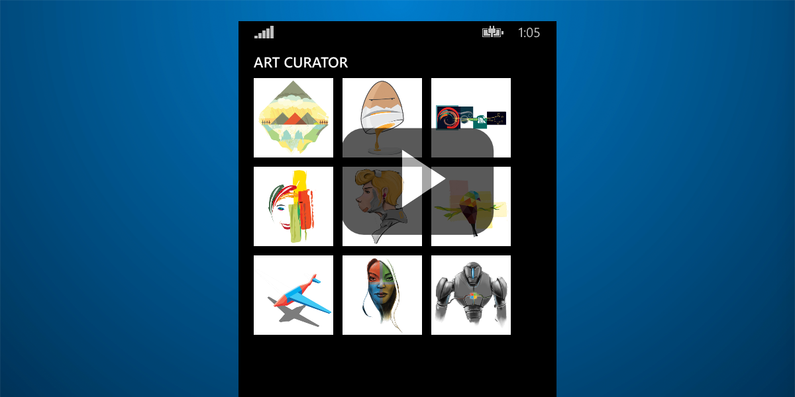

# Art Curator para Windows Phone

Este exemplo demonstra como usar a API de Email do Outlook para obter emails e anexos do Office 365. Ele foi criado para [iOS](https://github.com/OfficeDev/O365-iOS-ArtCurator), [Android](https://github.com/OfficeDev/O365-Android-ArtCurator), [Web (aplicativo Web do Angular)](https://github.com/OfficeDev/O365-Angular-ArtCurator) e Windows Phone. Confira nosso [artigo sobre o Medium](https://medium.com/office-app-development).

O Art Curator oferece uma maneira diferente de exibir sua caixa de entrada. Imagine que você possui uma empresa que vende camisetas artísticas. Como proprietário da empresa, você recebe muitos emails de artistas com designs que eles querem que você compre. Em vez de usar o Outlook e abrir cada email individualmente, baixando a imagem anexada, e, em seguida, abrir a imagem para exibi-la, você pode usar o Art Curator para ter uma exibição prévia do anexo (../limitado aos arquivos: .jpg e .png) de sua caixa de entrada para escolher designs que você gosta de uma forma mais eficiente.

Este exemplo demonstra as seguintes operações a partir da **API de Email do Outlook**:
* [Obter pastas](https://msdn.microsoft.com/office/office365/APi/mail-rest-operations#GetFolders)
* [Obter mensagens](https://msdn.microsoft.com/office/office365/APi/mail-rest-operations#Getmessages) (incluindo filtragem e o uso da opção selecionar) 
* [Obter anexos](https://msdn.microsoft.com/office/office365/APi/mail-rest-operations#GetAttachments)
* [Atualizar mensagens](https://msdn.microsoft.com/office/office365/APi/mail-rest-operations#Updatemessages)
* [Criar e enviar mensagens](https://msdn.microsoft.com/office/office365/APi/mail-rest-operations#Sendmessages) (com e sem anexo) 

## Pré-requisitos

Esse exemplo requer o seguinte:  

  - Windows 8.1
  - Visual Studio de 2013 com Atualização 3
  - [Ferramentas de API do Office 365 versão 1.4.50428.2](http://aka.ms/k0534n)
  - Um [Site do Desenvolvedor do Office 365](http://aka.ms/ro9c62)
  - Uma [conta de Desenvolvedor do Aplicativo do Windows](https://appdev.microsoft.com/StorePortals/en-us/Account/signup/start)

### Configurar o exemplo

Siga estas etapas para configurar o exemplo.

   1. Abra o arquivo **O365-Windows-Phone-Art-Curator.sln** usando o Visual Studio 2013.
   2. Crie a solução. O recurso Restauração do Pacote NuGet carregará os assemblies listados no arquivo packages.config.
   3. Registre e configure o aplicativo para consumir os serviços do Office 365 (detalhados abaixo).

### Registrar o aplicativo para usar APIs do Office 365

Você pode fazer isso usando as Ferramentas de API do Office 365 para Visual Studio (o que automatiza o processo de registro). Baixe e instale as Ferramentas de API do Office 365 da Galeria do Visual Studio.

**Observação**: Se você vir erros durante a instalação dos pacotes (por exemplo, *Não foi possível encontrar "Microsoft.IdentityModel.Clients.ActiveDirectory"*), verifique se o caminho do local onde você colocou a solução não é muito longo/profundo. Para resolver esse problema, coloque a solução junto à raiz da unidade.

   1. Na janela do Gerenciador de Soluções, escolha projeto **O365-Windows-Phone-Art-Curator** -> Adicionar -> Serviço Conectado.
   2. Uma caixa de diálogo do Gerenciador de Serviços será exibida. Escolha o Office 365 e Registrar seu aplicativo.
   3. Na caixa de diálogo de entrada, insira o nome de usuário e a senha de seu locatário do Office 365. Recomendamos que você use seu Site do Desenvolvedor do Office 365. Muitas vezes, esse nome de usuário seguirá o padrão {nomedeusuario}@{locatario}.onmicrosoft.com. Se não tiver um site do desenvolvedor, você pode obter um Site do Desenvolvedor gratuito como parte dos seus Benefícios do MSDN ou inscrever-se em uma avaliação gratuita. Lembre-se de que o usuário deve ser um Administrador de Locatários. No entanto, isso já deve acontecer com locatários criados como parte de um Site do Desenvolvedor do Office 365. As contas de desenvolvedor também são geralmente limitadas a um entrada.
   4. Após entrar, você verá uma lista de todos os serviços. Inicialmente, nenhuma permissão será selecionada porque o aplicativo ainda não está registrado para consumir serviços. 
   5. Para se registrar nos serviços usados neste exemplo, escolha as permissões a seguir:  
      * (Email) - *Enviar email como um usuário*
      * (Email) - *Ler e gravar emails de usuários*
   6. Clique em OK na caixa de diálogo do Gerenciador de Serviços.

## Executar o aplicativo

Após carregar a solução no Visual Studio, pressione F5 para criar e implantar.

## Compreender o código
   
### Limitações

Os recursos a seguir não são incluídos na versão atual.

* Suporte a arquivos além de .png e .jpg
* Lidar com uma única mensagem de email com vários anexos
* Paginação (recebendo mais de 50 emails)
* Lidar com exclusividade de nome de pasta
* A pasta de envio deve ser uma pasta de nível superior  

## Perguntas e comentários

- Se você tiver problemas para executar este exemplo [registre um problema](https://github.com/OfficeDev/O365-WinPhone-ArtCurator/issues).
- Para perguntas gerais sobre as APIs do Office 365, poste no [Stack Overflow](http://stackoverflow.com/). Verifique se suas perguntas ou seus comentários estão marcados com [office365].
  

## Recursos adicionais

* [Office 365 APIs platform overview](http://msdn.microsoft.com/office/office365/howto/platform-development-overview)
* [Centro de Desenvolvimento do Office](http://dev.office.com/)
* [Art Curator para iOS](https://github.com/OfficeDev/O365-iOS-ArtCurator)
* [Art Curator para Android](https://github.com/OfficeDev/O365-Android-ArtCurator)
* [Art Curator para Web](https://github.com/OfficeDev/O365-Angular-ArtCurator)

## Copyright

Copyright (c) Microsoft. Todos os direitos reservados.
 

