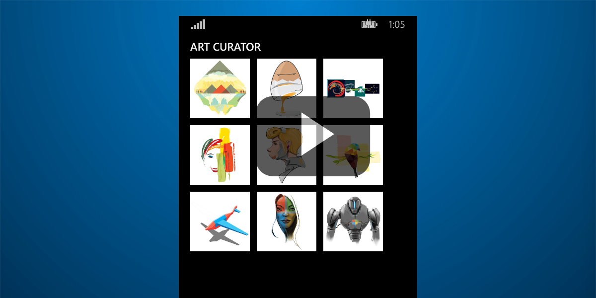

# Art Curator for Windows Phone

This sample demonstrates how to use the Outlook Mail API to get emails and attachments from Office 365. It's built for [iOS](https://github.com/OfficeDev/O365-iOS-ArtCurator), [Android](https://github.com/OfficeDev/O365-Android-ArtCurator), [Web (Angular web app)](https://github.com/OfficeDev/O365-Angular-ArtCurator), and Windows Phone. Check out our [article on Medium](https://medium.com/office-app-development).

Art Curator is a different way to view your inbox. Imagine you own a company that sells artistic t-shirts. As the owner of the company, you receive lots of emails from artists with designs they want you to buy. Instead of using Outlook and opening every individual email, downloading the attached picture, and then opening it to view, you can use Art Curator to give you an attachment-first (limited to .jpg and .png files) view of your inbox to pick and choose designs you like in a more efficient way.

This sample demonstrates the following operations from the **Outlook Mail API**:
* [Get folders](https://msdn.microsoft.com/office/office365/APi/mail-rest-operations#GetFolders)
* [Get messages](https://msdn.microsoft.com/office/office365/APi/mail-rest-operations#Getmessages) (including filtering and using select) 
* [Get attachments](https://msdn.microsoft.com/office/office365/APi/mail-rest-operations#GetAttachments)
* [Update messages](https://msdn.microsoft.com/office/office365/APi/mail-rest-operations#Updatemessages)
* [Create and send messages](https://msdn.microsoft.com/office/office365/APi/mail-rest-operations#Sendmessages) (with and without an attachment) 

## Prerequisites

This sample requires the following:  

  - Windows 8.1
  - Visual Studio 2013 with Update 3
  - [Office 365 API Tools version 1.4.50428.2](http://aka.ms/k0534n)
  - An [Office 365 developer site](http://aka.ms/ro9c62)
  - A [Windows App Developer account](https://appdev.microsoft.com/StorePortals/en-us/Account/signup/start)

### Configure the sample

Follow these steps to configure the sample.

   1. Open the **O365-Windows-Phone-Art-Curator.sln** file using Visual Studio 2013.
   2. Build the solution. The NuGet Package Restore feature will load the assemblies listed in the packages.config file.
   3. Register and configure the app to consume Office 365 services (detailed below).

### Register app to use the Office 365 APIs

You can do this via the Office 365 API Tools for Visual Studio (which automates the registration process). Be sure to download and install the Office 365 API tools from the Visual Studio Gallery.

**Note**: If you see any errors while installing packages (for example, *Unable to find "Microsoft.IdentityModel.Clients.ActiveDirectory"*) make sure the local path where you placed the solution is not too long/deep. Moving the solution closer to the root of your drive resolves this issue.

   1. In the Solution Explorer window, choose **O365-Windows-Phone-Art-Curator** project -> Add -> Connected Service.
   2. A Services Manager dialog box will appear. Choose Office 365 and Register your app.
   3. On the sign-in dialog box, enter the username and password for your Office 365 tenant. We recommend that you use your Office 365 Developer Site. Often, this user name will follow the pattern {username}@{tenant}.onmicrosoft.com. If you do not have a developer site, you can get a free Developer Site as part of your MSDN Benefits or sign up for a free trial. Be aware that the user must be an Tenant Admin user, but for tenants created as part of an Office 365 Developer Site, this is likely to be the case already. Also developer accounts are usually limited to one sign-in.
   4. After you're signed in, you will see a list of all the services. Initially, no permissions will be selected, as the app is not registered to consume any services yet. 
   5. To register for the services used in this sample, choose the following permissions:  
      * (Mail) - *Send mail as a user*
      * (Mail) - *Read and write user mail*
   6. Click OK in the Services Manager dialog box.

## Run the app

After you've loaded the solution in Visual Studio, press F5 to build and deploy.

## Understand the code
   
### Limitations

The following features are not included in the current version.

* File support beyond .png and .jpg
* Handling a single email with multiple attachments
* Paging (getting more than 50 emails)
* Handling folder name uniqueness
* Submission folder must be a top-level folder  

## Questions and comments

- If you have any trouble running this sample, please [log an issue](https://github.com/OfficeDev/O365-WinPhone-ArtCurator/issues).
- For general questions about the Office 365 APIs, post to [Stack Overflow](http://stackoverflow.com/). Make sure that your questions or comments are tagged with [office365].
  

## Additional resources

* [Office 365 APIs platform overview](http://msdn.microsoft.com/office/office365/howto/platform-development-overview)
* [Office Dev Center](http://dev.office.com/)
* [Art Curator for iOS](https://github.com/OfficeDev/O365-iOS-ArtCurator)
* [Art Curator for Android](https://github.com/OfficeDev/O365-Android-ArtCurator)
* [Art Curator for Web](https://github.com/OfficeDev/O365-Angular-ArtCurator)

## Copyright

Copyright (c) Microsoft. All rights reserved.
 
